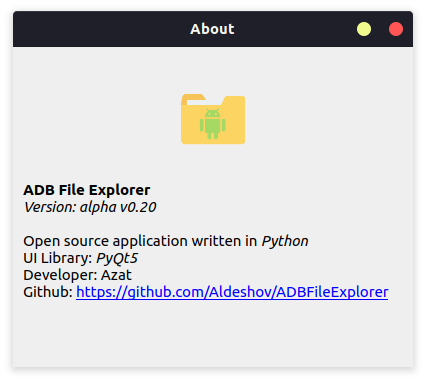

# ADB File Explorer `alpha v0.31`

<pre>
Simple File explorer for ADB devices
All in one project
contains all necessary files to work with android devices
</pre>

Project not finished and requires further development 

## Screenshots
* About program  

* Devices screen  

* Files screen  

<pre>*Window style depends on OS type and theme</pre>
## Contains

/bin - executable adb files  
/assets - icons storage  
/src - source code written in `python`  

### Requirements
* `Python 3.8` or `Python 3.9`
  (other versions not tested)

* virtual environment (Optional)
* pip installation with <b> requirements.txt </b>

## What works

At the moment works features like:

* showing devices
* Connecting to devices by IP
* showing files and directories of devices
* pulling files
* pushing files

<h2>Not works:</h2>
- Copying files  
- Moving files  
- Deleting files  
- Renaming files  
in the device

## Inroduction to the code

<pre>
Project main packages are:
<b>GUI</b> and <b>SERVICES</b>
app starts from <i>app.py</i> file

Folder <b>GUI</b> contains <i>PyQt5</i> ui elements, widgets, window etc.
Folder <b>SERVICES</b> contains files that runs subprocesses and gets data from <i>ADB</i>, converts it to models

The most editable file is <i>drivers.py</i>
it tries to get data from adb command, and converts it to models
At the moment, this file needs to be checked for operability on various types of devices.
</pre>

<pre>
P.S. Further development depends on my free time
</pre>