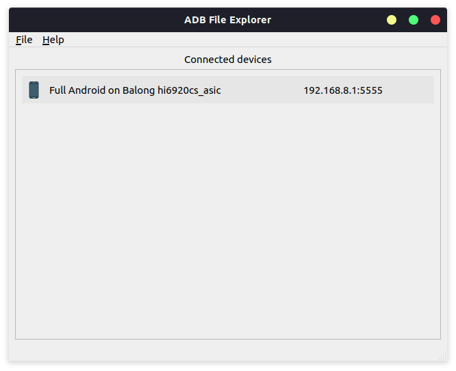
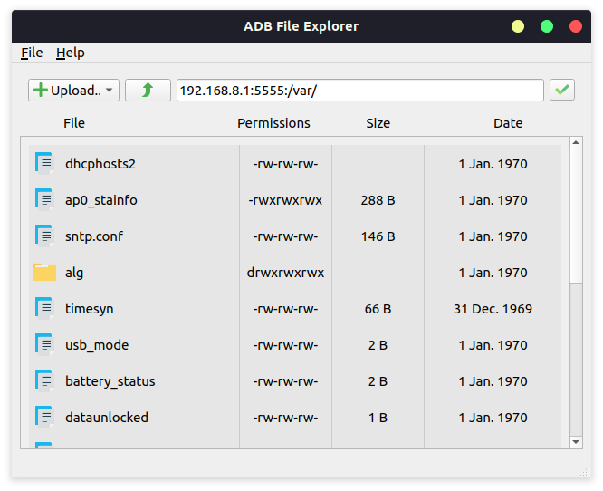

# ADB File Explorer `beta v0.4`

<pre>
Simple File explorer for ADB devices

Allows you to see list of files on your device
and upload to/download it
</pre>

# TODO 
# Project not finished and requires further development 
# Possible future features: 
# ● File:Settings - modify settings and store in <code>settings.json</code> 
# ● Tool:APK Manager - list/download apks  
# ✅ Tested on: Ubuntu 20.04 & Windows 10 (last for 19.11.2021) 

### Downloading binaries (executables)

<a href='https://github.com/Aldeshov/ADBFileExplorer/releases/tag/beta-v0.4'>
● Download for Linux and Windows 
</a>

## Screenshots

* Devices screen  
  
* Files screen  
  

<pre>*Window style depends on OS type and theme</pre>

## Contains [Main packages]

/res - project resources  
/src - project source code in `python`  
adb should exist in project root folder or in `PATH` variable

### Requirements

* `Python 3.8` or `Python 3.9`
  (other versions not tested)

* virtual environment (Optional)

* pip installation with `requirements.txt`

## What works

<b>At the moment works features like:</b>

* Showing devices
* Connecting to devices by IP / Disconnecting
* Showing files and directories of devices
* Pulling files
* Pushing files

<h2>Not works:</h2>
- Copying files  
- Moving files  
- Deleting files  
- Renaming files  
in the device

## Introduction to the code

<pre>
Project main packages are:
<b>GUI</b> and <b>SERVICES</b>
app starts from <i>app.py</i> file

Folder <b>GUI</b> contains <i>PyQt5</i> ui elements, widgets, window etc.
Folder <b>SERVICES</b> contains files that runs subprocesses and gets data from <i>ADB</i>, converts it to models

The most editable file is <i>drivers.py</i>
it tries to get data from adb command, and converts it to models
At the moment, this file needs to be checked for issues on various types of devices.
</pre>